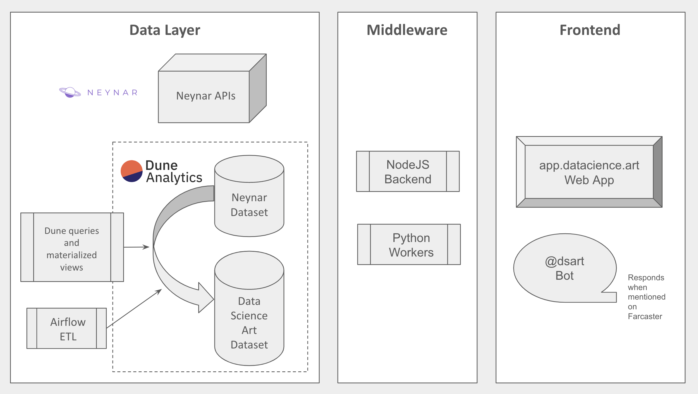

# Farcaster Data Analytics Project

Welcome to this Data Science Art experiment!

I built it to explore the Farcaster protocol and run ML experiments in this rich playground.

Hope you'll find it useful or educational. Feel free to reach out if you have any questions or feedback.

## Overview

What I built so far:

* A couple of ML models to classify the casts and calculate embeddings and features such as sentiment, informational, funny. Those are built as python workers.
* An ETL to run my models and populate Dune datasets, plus queries and materialized views to service the web app and the bot.
* A data analytics web app: [app.datascience.art](https://app.datascience.art/)
* A bot: [@dsart](https://warpcast.com/dsart)

## Data Layer
The data layer is built on top of Neynar's API and Dune dataset.

The airflow jobs source code is in this [fc_airflow repository](https://github.com/randombishop/fc_airflow)

The Dune tables, materialized views and queries are all published publicly: [search for @dsart on Dune](https://dune.com/discover/content/relevant?q=@dsart)

The DSArt Dune dataset provides a unique and ML friendly data perspective. 

For example, it provides a single table that represents the social graph with one row per follower/followed, including the follow relationshop andthe total count of likes, replies and recasts.

Also, in the [casts_features table](./casts_features.md), you will find embeddings, usefull for ML tasks, category and topic classification, plus interesting features coming from the Gambit model and Likemeter. (more on these on the sections below.)

Finally, there is a [fids_features table](./fids_features.md) that provides some interesting feature engineering effort for each user.

## Gambit model
The Gambit model is a NN that uses a 512 embedding of the cast as input, and classifies it into categories, topics, reduces the embedding to 32 dimensions, and also adds the following interesting features:
* Is it clear?
* Does it have a clear target audience?
* Is it informative?
* Is it easy to understand for the general layman public?
* Is it verifiable online?
* Is it personal?
* Is it funny?
* Is it a reference to a well known meme?
* Does it elicit an emotional response?
* Does it convey happiness?
* Does it trigger curiosity?
* Is it aggressive?
* Does it have an element of surprise?
* Does it ask an interesting question?
* Does it come with an explicit call to action?

## Likemeter
The likemeter uses the features generated by the Gambit model to predict if a cast will be liked/recasted/replied-to.

## The Bot
The @dsart bot is a cool way to run the data functions.

The following type of requests are currently supported:

### Queries about posts
* Summarizes posts by channel, keywords, or topic.
* Picks the best post from a channel or by keywords. (Can use custom criteria.)

### Queries about users
* Finds the favorite accounts of a user.
* Lists the most active users in a channel or by keywords.
* Make a word cloud of a user's posts and reactions.
* Generate a psychoanalysis for a user.
* Generate a roast for a user.

### Generic queries
* Responds in natural language. Uses a LLM to generate an answer.

The bot code and prompts are open sourced in the [fc_bots repository](https://github.com/randombishop/fc_bots), it is designed to be easily extensible 
and only rely on public Dune data, so everyone can develop, test and contribute new functions.

## The Web App

The front end is a React app to explore the data and gain insights.

* The source code lives in this [repo](https://github.com/randombishop/fc_front)

* A replit is also available [here](https://replit.com/@nabilabdellaoui/fcfront)

* Check it out live at [app.datascience.art](https://app.datascience.art/)
